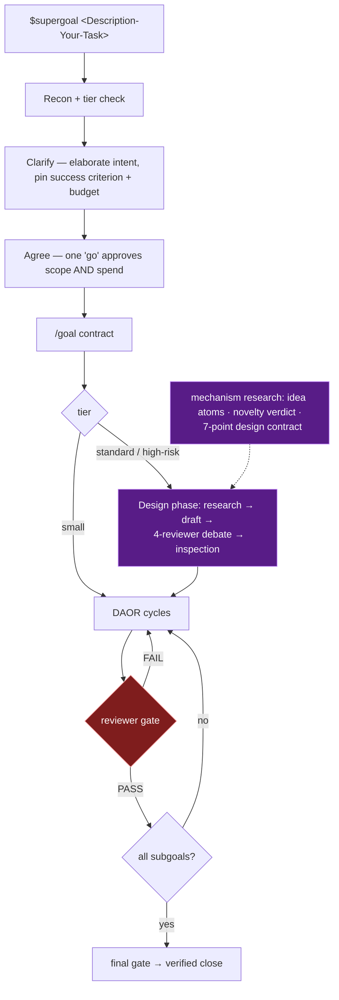

<div align="center">

# SuperGoal

**An upgraded `/goal` for Codex CLI — it cannot call work "done" until the evidence is on disk.**


`$supergoal <Description-Your-Task>` &nbsp;→&nbsp; recon → contract → design debate → evidence loop → adversarial review → verified close

<sub>🌐 English · <a href="README.zh-CN.md">中文</a></sub>

</div>

---

A plain `/goal` pins your words as written and trusts the model to judge
"achieved". SuperGoal turns the same request into a **mission**: it scouts
the repo before asking anything, pins an explicit success criterion,
iterates in falsifiable Design–Act–Observe–Reason cycles, and a separate
reviewer agent plus a mechanical Stop hook block the session from ending
while any claim lacks its logged proof.

**Use it for** debugging, refactoring, risky features, services and sites,
crawlers and data pipelines, model training, module and loss ideation,
research reproduction.
**Skip it for** one-line answers — it will refuse them anyway.

## Why not just `/goal`?

| | plain `/goal` | SuperGoal |
| --- | --- | --- |
| Intent | your words, pinned as-is | repo recon, then only the questions the repo can't answer |
| Contract | one goal statement | objective + success criterion + assumptions + budget, one "go" to approve |
| Design | starts coding | risky missions first survive research + a 4-reviewer design debate |
| Review | self-review, same context | separate reviewer agent attacks every completion claim |
| "Done" | the model judges "achieved" | Stop hook cross-checks every checked box against logged verdicts |
| Memory | starts from zero | lessons, plans, and evidence persist in `.supergoal/` files |

## How a mission flows



Clarify's whole job is elaborating your intent — the questions the repo
can't answer, the success criterion, the budget. One "go" at Agree approves
scope and spend together; nothing autonomous and expensive runs before it.
Small missions then go straight to work (three agents, zero ceremony).
Standard and high-risk missions open the loop with a design phase before
any code — a `researcher` builds cited claims (community-first for
troubleshooting, literature- or docs-first for surveys), a `designer`
drafts, four differentiated reviewers debate it (completeness, failure
modes, verifiability, leanness), and a fresh-eyes inspection signs off —
all journaled, all inside the contract's budget. High-risk missions must
survive at least two debate rounds.

Mechanism research — a new module, loss, or training signal — gets extra
teeth: the `researcher` distills prior work into component-level idea atoms
and returns an honest novelty verdict on every proposed mechanism, and no
draft reaches debate until it pins the seven-point research design
contract — evidenced failure mode, tensor-level mechanism, the actual
equation, gradient intuition, prior-work basis, an ablation matrix with a
parameter-matched control, and kill criteria. Ideas killed for prior art
become lessons that are never re-proposed, and the completion gate checks
the diff implements the stated mechanism — a gain that vanishes under
matched capacity was never the mechanism.

## What a session looks like

```text
You:  $supergoal speed up our test suite, CI is painfully slow

It:   Recon: pytest + tox; CI ~14 min; 3 test files take 70% of the time.
      1. Success criterion?  A. CI < 5 min on the runner (recommended)  B. < 8 min  C. yours
      2. May I add pytest-xdist? (high-risk to assume)  A. Yes  B. No

You:  1A 2A

It:   Objective: CI wall-clock < 5 min · verify: `time pytest -q -n auto` < 300s
      Plan: SG1 baseline profile → SG2 xdist + fixture isolation → SG3 cache → FINAL gate
      Assumptions: [low] CI config editable · Budget: 10 cycles
      Reply "go" to start.

You:  go

It:   [/goal created · plan gate GO · baseline 14m02s quoted from CI log]
      [C1..C6: hypothesis → change → quoted result → reviewer verdict, journaled]
      Final report: 14m02s → 4m41s, evidence per subgoal, reviewer PASS.
```

A precise request skips the questions: recon, one Agree message, "go".

## Install

```bash
# global (all projects)
mkdir -p ~/.codex/skills/supergoal
cp -R . ~/.codex/skills/supergoal/
```

Or repo-scoped: copy this folder to `<repo>/.codex/skills/supergoal`. Then
invoke explicitly: `$supergoal <task>`.

Setup runs automatically on first invocation and installs the rest — but it
**requires** (and fails closed without):

- **Goals feature** — `codex features enable goals` (Codex ≥ 0.128).
- **Stop hook** — the completion audit (`hooks/stop_audit.py`); Windows
  command variants in [`references/codex.md`](references/codex.md).
- **Ten custom agents** — GPT-5.5/xhigh, installed from `config/`.

**Changing models later:** edit `model` / `model_reasoning_effort` in every
`config/*.toml` and the two model keys in `config/config.toml.snippet`, then
recopy into `<repo>/.codex/`. Nothing else references a model name.

## What lives on disk

| File | Role |
| --- | --- |
| `.supergoal/BRIEF.md` | intent — objective, boundaries, success criterion, assumptions |
| `.supergoal/PLAN.md` | claims — subgoal checkboxes the Stop hook machine-reads |
| `.supergoal/JOURNAL.md` | evidence — append-only cycle ledger with quoted results and verdicts |
| `.supergoal/RESEARCH / DESIGN / DEBATE.md` | design phase (standard/high-risk only) |
| `.supergoal/EXPERIMENTS.md` | ML run ledger — PENDING rows block completion |
| `.supergoal/PROJECT.md` · `BACKLOG.md` · `archive/` | lessons that compound, parked ideas, finished missions |

Every mission is resumable from these files alone — kill the session at any
point and the router infers where to continue. Chat history is never the
state.

## Repository map

| Path | What it is |
| --- | --- |
| `SKILL.md` | the skill: principles, router, phases, hard rules |
| `references/` | seven playbooks, loaded per phase: clarify, DAOR loop, review protocol, design cluster, ML experiments, lifecycle, Codex wiring |
| `config/` | ten agent cards + config snippet (models, sandboxes, thread limits) |
| `hooks/` | Stop + SubagentStop audits, each with an assert-based self-test |
| `docs/field-validation.md` | the nine measurements the first real missions must take |

## FAQ

**Why does it ask questions? Other tools just start.**
Guessing an ambiguous success criterion is how work gets marked done without
being done. The interview is capped — at most 5 questions, each grounded in
recon with a recommended default. A precise request gets zero.

**How many round trips before work starts?**
Typically two (answers, then "go"). One for a precise request.

**What if it gets stuck?**
Hard stop rules: budget caps, three non-improving cycles, and a
first-principles rule — two failed patches on one root cause forbid a third.
Blocked work is reported as blocked, never papered over.

**Windows? No git?**
Both supported — the hook command needs the right shell variant
([`references/codex.md`](references/codex.md)); repos without git use an
absolute hook path.

## Honest limits

- The Stop hook checks ledger consistency, not scientific validity — the
  reviewer gates and quoted-evidence rules exist for that.
- The SubagentStop write-scope hook is **experimental** (designed from docs,
  not yet verified on a live install); it degrades to "do not block", and a
  scheduler-side audit covers it meanwhile.
- Design-heavy missions cost ~10–14 strong-model calls before the first edit,
  by design; small missions never pay it.
- Nine platform assumptions await behavioral confirmation on a live Codex
  build — tracked with their deciding measurements in
  [`docs/field-validation.md`](docs/field-validation.md).
