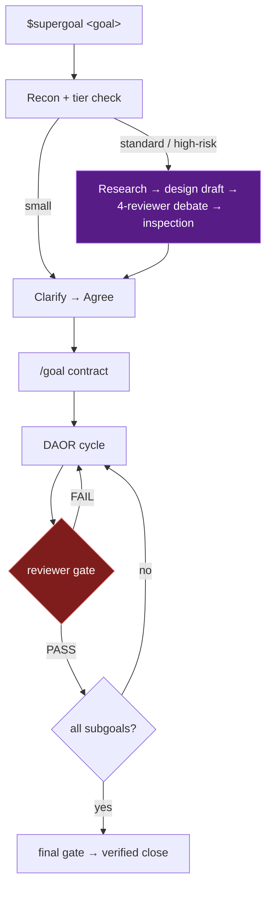

<div align="center">

# ✨ SuperGoal

**An upgraded `/goal` for Codex CLI — it cannot call work "done" until the evidence is on disk.**


`$supergoal <goal>` &nbsp;→&nbsp; recon → contract → design debate → evidence loop → adversarial review → verified close

<sub>🌐 English · <a href="README.zh-CN.md">中文</a></sub>

</div>

---

A plain `/goal` pins your words as written and trusts the model to judge
"achieved". SuperGoal turns the same request into a **mission**: it scouts
the repo before asking anything, pins an explicit success criterion,
iterates in falsifiable Design–Act–Observe–Reason cycles, and a separate
reviewer agent plus a mechanical Stop hook block the session from ending
while any claim lacks its logged proof.

✅ **Use it for** debugging, refactoring, risky features, services and sites,
crawlers and data pipelines, model training, research reproduction.
⏭️ **Skip it for** one-line answers — it will refuse them anyway.

## 🤔 Why not just `/goal`?

| | plain `/goal` | SuperGoal |
| --- | --- | --- |
| Intent | your words, pinned as-is | repo recon, then only the questions the repo can't answer |
| Contract | one goal statement | objective + success criterion + assumptions + budget, one "go" to approve |
| Design | starts coding | risky missions first survive research + a 4-reviewer design debate |
| Review | self-review, same context | separate reviewer agent attacks every completion claim |
| "Done" | the model judges "achieved" | Stop hook cross-checks every checked box against logged verdicts |
| Memory | starts from zero | lessons, plans, and evidence persist in `.supergoal/` files |

## 🧭 How a mission flows



Small missions stay lean (three agents, zero ceremony). Standard and
high-risk missions earn a design harness before any code: a `researcher`
builds cited claims (community-first for troubleshooting, literature- or
docs-first for surveys), a `designer` drafts, four differentiated reviewers
debate it — completeness, failure modes, verifiability, leanness — and a
fresh-eyes inspection signs off. High-risk missions must survive at least
two debate rounds. The tier is decided once, logged, and announced with its
research cost before anything is spent.

## 💬 What a session looks like

```text
You:  $supergoal How can I improve SAM 3 for identifying buildings in remote sensing imagery?

It:   Recon: segmentation repo found; GeoTIFF tiling, SAM 3 adapters, building
      masks, and an eval script reporting IoU/F1 by AOI.
      1. Success criterion?
         A. +5 building F1 on a cross-city holdout, with no precision drop > 1 point (recommended)
         B. +3 building mIoU
         C. yours
      2. Allowed work?
         A. prompts, adapters, loss, sampling, and augmentation only (recommended)
         B. full fine-tune
         C. architecture changes allowed
      3. Evidence budget?
         A. one reproduced baseline + two ablations (recommended)
         B. quick smoke experiment only
         C. full sweep

You:  1A 2A 3A

It:   Objective: improve SAM 3 building extraction for remote sensing imagery.
      Verify: `python evaluate.py --split cross_city --class building`
      shows building F1 improves by >= 0.05 and precision drops by <= 0.01.
      Plan: SG1 reproduce baseline → SG2 inspect false positives/negatives →
      SG3 run adapter/data ablations → SG4 confirm best variant → FINAL gate
      Assumptions: [low] labels are usable; [medium] GPU budget covers 3 runs.
      Reply "go" to start.

You:  go

It:   [/goal created · .supergoal/PLAN.md + BRIEF.md written]
      [Research: remote-sensing segmentation papers and repo docs cited]
      [C1..C5: baseline → hypothesis → run command → metric table → reviewer verdict]
      Final report: cross-city F1 0.712 → 0.768, precision unchanged;
      ablation table, changed files, and reviewer PASS are linked from JOURNAL.md.
```

A precise request skips the questions: recon, one Agree message, "go".

## 📦 Install

```bash
# global (all projects)
mkdir -p ~/.codex/skills/supergoal
cp -R . ~/.codex/skills/supergoal/
```

Or repo-scoped: copy this folder to `<repo>/.codex/skills/supergoal`. Then
invoke explicitly: `$supergoal <task>`.

Setup runs automatically on first invocation and installs the rest — but it
**requires** (and fails closed without):

- **Goals feature** — `codex features enable goals` (Codex ≥ 0.128).
- **Stop hook** — the completion audit (`hooks/stop_audit.py`); Windows
  command variants in [`references/codex.md`](references/codex.md).
- **Ten custom agents** — GPT-5.5/xhigh, installed from `config/`.

**Changing models later:** edit `model` / `model_reasoning_effort` in every
`config/*.toml` and the two model keys in `config/config.toml.snippet`, then
recopy into `<repo>/.codex/`. Nothing else references a model name.

## 🗂️ What lives on disk

SuperGoal stores mission files directly in the current project under
`.supergoal/`.

| File | Role |
| --- | --- |
| `.supergoal/BRIEF.md` | intent — objective, boundaries, success criterion, assumptions |
| `.supergoal/PLAN.md` | claims — subgoal checkboxes the Stop hook machine-reads |
| `.supergoal/JOURNAL.md` | evidence — append-only cycle ledger with quoted results and verdicts |
| `.supergoal/DRAFT_BRIEF / RESEARCH / DESIGN / DEBATE.md` | design harness (standard/high-risk only) |
| `.supergoal/EXPERIMENTS.md` | ML run ledger — PENDING rows block completion |
| `.supergoal/PROJECT.md` · `BACKLOG.md` · `archive/` | lessons that compound, parked ideas, finished missions |

Every mission is resumable from these files alone — kill the session at any
point and the router infers where to continue. Chat history is never the
state.

## 🗺️ Repository map

| Path | What it is |
| --- | --- |
| `SKILL.md` | the skill: principles, router, phases, hard rules |
| `references/` | seven playbooks, loaded per phase: clarify, DAOR loop, review protocol, design cluster, ML experiments, lifecycle, Codex wiring |
| `config/` | ten agent cards + config snippet (models, sandboxes, thread limits) |
| `hooks/` | Stop + SubagentStop audits, each with an assert-based self-test |
| `docs/field-validation.md` | the nine measurements the first real missions must take |

## ❓ FAQ

**Why does it ask questions? Other tools just start.**
Guessing an ambiguous success criterion is how work gets marked done without
being done. The interview is capped — at most 5 questions, each grounded in
recon with a recommended default. A precise request gets zero.

**How many round trips before work starts?**
Typically two (answers, then "go"). One for a precise request.

**What if it gets stuck?**
Hard stop rules: budget caps, three non-improving cycles, and a
first-principles rule — two failed patches on one root cause forbid a third.
Blocked work is reported as blocked, never papered over.

**Windows? No git?**
Both supported — the hook command needs the right shell variant
([`references/codex.md`](references/codex.md)); repos without git use an
absolute hook path.

## ⚠️ Honest limits

- The Stop hook checks ledger consistency, not scientific validity — the
  reviewer gates and quoted-evidence rules exist for that.
- The SubagentStop write-scope hook is **experimental** (designed from docs,
  not yet verified on a live install); it degrades to "do not block", and a
  scheduler-side audit covers it meanwhile.
- Design-heavy missions cost ~10–14 strong-model calls before the first edit,
  by design; small missions never pay it.
- Nine platform assumptions await behavioral confirmation on a live Codex
  build — tracked with their deciding measurements in
  [`docs/field-validation.md`](docs/field-validation.md).
