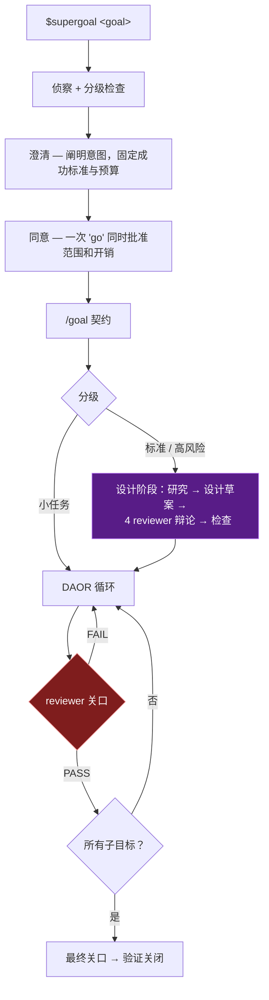

<div align="center">

# ✨ SuperGoal

**Codex CLI 的升级版 `/goal`：除非证据已经写入磁盘，否则它不能把工作称为“完成”。**


`$supergoal <goal>` &nbsp;→&nbsp; 侦察 → 契约 → 设计辩论 → 证据循环 → 对抗审查 → 验证关闭

<sub>🌐 <a href="README.md">English</a> · 中文</sub>

</div>

---

普通 `/goal` 会按原样固定你的文字，并相信模型自己判断是否
“已达成”。SuperGoal 会把同一个请求变成一项**任务**：它先侦察
仓库，再只询问仓库无法回答的问题，固定明确的成功标准，在可证伪的
Design-Act-Observe-Reason 循环中迭代，并由独立 reviewer agent 加上
机械 Stop hook 阻止会话在任何缺少日志证据的声明下结束。

✅ **适合用于**调试、重构、高风险功能、服务和站点、爬虫和数据管道、
模型训练、模块与损失函数创新、研究复现。⏭️ **不适合用于**一句话回答——
它无论如何都会拒绝。

## 🤔 为什么不直接用 `/goal`？

| | 普通 `/goal` | SuperGoal |
| --- | --- | --- |
| 意图 | 你的文字，原样固定 | 先做仓库侦察，然后只问仓库无法回答的问题 |
| 契约 | 一个目标陈述 | objective + success criterion + assumptions + budget，一次“go”确认 |
| 设计 | 直接开始编码 | 高风险任务先经过研究 + 4 reviewer 设计辩论 |
| 审查 | 同一上下文里的自审 | 独立 reviewer agent 攻击每个完成声明 |
| “完成” | 模型判断“已达成” | Stop hook 对照日志 verdict 检查每个勾选项 |
| 记忆 | 从零开始 | 经验、计划和证据持久化到 `.supergoal/` 文件 |

## 🧭 一项任务如何流转



澄清阶段的全部职责就是阐明你的意图——仓库无法回答的问题、成功标准、
预算。Agree 的一次 “go” 同时批准范围和开销；在此之前不会运行任何
自主且昂贵的环节。小任务随后直接开工（三个 agents，零仪式）。标准和
高风险任务则以设计阶段开启循环，在任何代码改动之前：`researcher`
生成带引用的声明（排障时优先社区资料，调研时优先文献或文档），
`designer` 起草方案，四个差异化 reviewers 围绕完整性、失败模式、
可验证性、精简性展开辩论，再由 fresh-eyes inspection 签字确认——
全部记入日志，全部在契约预算之内。高风险任务至少要通过两轮辩论。

机制类研究——新模块、新损失函数或新训练信号——还有额外约束：
`researcher` 会把先前工作提炼成组件级 idea atoms，并对每个提出的机制
给出诚实的 novelty verdict；设计草案必须先满足七点 research design
contract——有证据的失败模式、张量级机制、真实公式、梯度直觉、
先前工作基础、带参数量对照组的消融矩阵、kill criteria——才能进入
辩论。因先前工作被否决的想法会沉淀为经验教训，不再被重复提出；
完成关口还会检查 diff 是否真的实现了所声明的机制——在参数量对齐后
消失的增益从来不是机制本身。

## 💬 一次会话是什么样子

```text
You:  $supergoal 如何改进 SAM 3，让它更好地识别遥感影像中的建筑？

It:   Recon: 找到分割仓库；已有 GeoTIFF 切片、SAM 3 adapters、建筑掩膜，
      以及按 AOI 输出 IoU/F1 的评估脚本。
      1. 成功标准？
         A. cross-city holdout 上建筑 F1 +5，precision 下降不超过 1 个点（推荐）
         B. 建筑 mIoU +3
         C. 你指定
      2. 允许哪些改动？
         A. 仅 prompts、adapters、loss、sampling、augmentation（推荐）
         B. full fine-tune
         C. 允许 architecture changes
      3. 证据预算？
         A. 一个复现 baseline + 两个 ablations（推荐）
         B. quick smoke experiment
         C. full sweep

You:  1A 2A 3A

It:   Objective: 改进 SAM 3 在遥感影像中的建筑提取效果。
      Verify: `python evaluate.py --split cross_city --class building`
      显示建筑 F1 提升 >= 0.05，且 precision 下降 <= 0.01。
      Plan: SG1 复现 baseline → SG2 检查 false positives/negatives →
      SG3 运行 adapter/data ablations → SG4 确认最佳变体 → FINAL gate
      Assumptions: [low] labels 可用；[medium] GPU budget 足够跑 3 次。
      Reply "go" to start.

You:  go

It:   [/goal created · .supergoal/PLAN.md + BRIEF.md written]
      [Research: 引用遥感分割论文和仓库文档]
      [C1..C5: baseline → hypothesis → run command → metric table → reviewer verdict]
      Final report: cross-city F1 0.712 → 0.768，precision 不变；
      ablation table、changed files、reviewer PASS 都已链接到 JOURNAL.md。
```

精确请求会跳过问题：侦察，一条 Agree 消息，然后 “go”。

## 📦 安装

```bash
# global (all projects)
mkdir -p ~/.codex/skills/supergoal
cp -R . ~/.codex/skills/supergoal/
```

或按仓库安装：把这个文件夹复制到 `<repo>/.codex/skills/supergoal`。
然后显式调用：`$supergoal <task>`。

首次调用时会自动运行设置并安装其余内容，但它**要求**以下组件存在
（缺失时会 fail closed）：

- **Goals feature** — `codex features enable goals`（Codex ≥ 0.128）。
- **Stop hook** — 完成审计（`hooks/stop_audit.py`）；Windows 命令变体见
  [`references/codex.md`](references/codex.md)。
- **Ten custom agents** — GPT-5.5/xhigh，从 `config/` 安装。

**之后更改模型：**编辑每个 `config/*.toml` 中的 `model` /
`model_reasoning_effort`，以及 `config/config.toml.snippet` 中的两个模型键，
然后重新复制到 `<repo>/.codex/`。没有其他地方引用模型名称。

## 🗂️ 磁盘上会保存什么

SuperGoal 会把任务文件直接保存在当前项目的 `.supergoal/` 目录下。

| 文件 | 作用 |
| --- | --- |
| `.supergoal/BRIEF.md` | 意图 — objective、边界、success criterion、assumptions |
| `.supergoal/PLAN.md` | 声明 — Stop hook 可机器读取的子目标复选框 |
| `.supergoal/JOURNAL.md` | 证据 — 只追加的循环账本，包含引用结果和 verdict |
| `.supergoal/RESEARCH / DESIGN / DEBATE.md` | 设计阶段（仅标准/高风险任务） |
| `.supergoal/EXPERIMENTS.md` | ML 运行账本 — PENDING 行会阻止完成 |
| `.supergoal/PROJECT.md` · `BACKLOG.md` · `archive/` | 可积累的经验、暂存想法、已完成任务 |

每项任务都能仅凭这些文件恢复——在任意时刻结束会话，router 都能推断
从哪里继续。聊天历史永远不是状态。

## 🗺️ 仓库结构

| 路径 | 内容 |
| --- | --- |
| `SKILL.md` | skill 本体：原则、router、阶段、硬规则 |
| `references/` | 七份按阶段加载的 playbooks：clarify、DAOR loop、review protocol、design cluster、ML experiments、lifecycle、Codex wiring |
| `config/` | 十张 agent cards + 配置片段（models、sandboxes、thread limits） |
| `hooks/` | Stop + SubagentStop audits，每个都有 assert-based 自测试 |
| `docs/field-validation.md` | 首批真实任务必须完成的九项测量 |

## ❓ FAQ

**为什么它会提问？其他工具会直接开始。**
猜测模糊的成功标准，正是工作还没完成却被标记为完成的原因。
访谈有上限——最多 5 个问题，每个都基于侦察结果并带推荐默认值。
精确请求不会被提问。

**工作开始前需要多少轮往返？**
通常两轮（回答，然后 “go”）。精确请求只需要一轮。

**如果它卡住了怎么办？**
硬停止规则：预算上限、三轮无改进循环，以及一条第一性原理规则——
同一个根因上两个补丁失败后禁止第三个。被阻塞的工作会报告为 blocked，
不会被粉饰成完成。

**Windows？没有 git？**
都支持——hook 命令需要正确的 shell 变体
（[`references/codex.md`](references/codex.md)）；没有 git 的仓库使用
绝对 hook 路径。

## ⚠️ 诚实的限制

- Stop hook 检查账本一致性，不检查科学有效性——reviewer gates 和
  quoted-evidence rules 正是为此存在。
- SubagentStop 写入范围 hook 是**实验性**的（基于文档设计，尚未在真实
  安装中验证）；它会降级为“不阻塞”，同时由 scheduler-side audit 覆盖。
- 设计密集型任务在首次编辑前会消耗约 10-14 次强模型调用，这是有意设计；
  小任务不会支付这笔成本。
- 九个平台假设仍等待在真实 Codex build 上进行行为确认——其决定性测量
  记录在 [`docs/field-validation.md`](docs/field-validation.md)。
